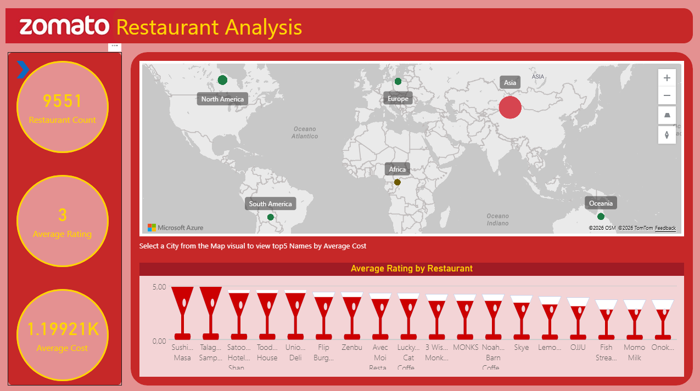
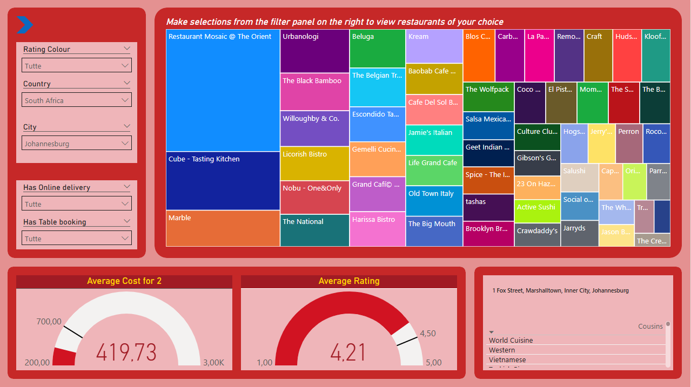
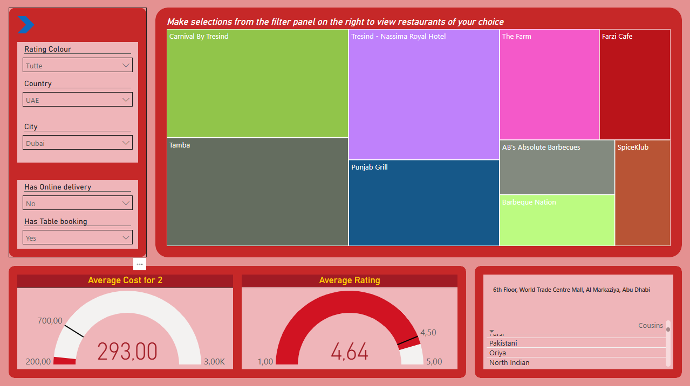
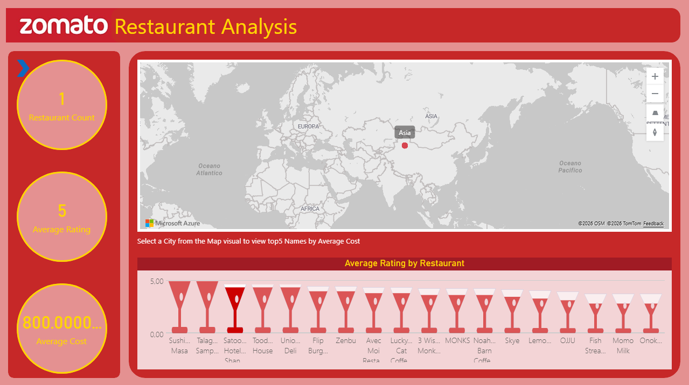

# Zomato Power BI Analysis

## Project Overview

This project presents an interactive Power BI dashboard designed to analyze restaurant performance, customer behavior, ratings, and business KPIs for Zomato.

The goal of the analysis is to transform raw restaurant data into clear business insights that can support decision-making.

## Business Objectives

- Analyze restaurant distribution by country and city
- Identify trends in customer ratings
- Evaluate restaurant performance by cuisine, location, and price range
- Create interactive visuals for business users
- Build a clear and user-friendly Power BI dashboard

## Tools Used

- Power BI
- Power Query
- DAX
- Excel / CSV
- Data Modeling

## Key Features

- Interactive dashboard pages
- KPI cards
- Restaurant rating analysis
- Country and city-level performance analysis
- Cuisine and price range analysis
- Clean data model for reporting

## Project Workflow

1. Data import into Power BI
2. Data cleaning with Power Query
3. Data modeling and relationship creation
4. DAX measures creation
5. Dashboard design
6. Business insight generation

## Dashboard Preview

### Global Overview


### Interactive Restaurant Analysis


### Regional Market Analysis


### Restaurant Rating Analysis


## Repository Structure

```text
zomato-powerbi-analysis/
│
├── README.md
├── pbix/
├── screenshots/
└── documentation/
```

## Business Value

This dashboard helps business users quickly understand restaurant performance, customer preferences, and market distribution through interactive visual analytics.

## Author

David Maria Olandese

